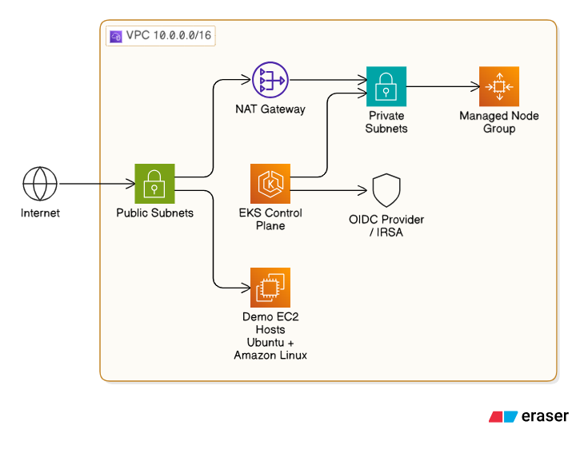

# Fiskaly SRE Assignment

Take-home assignment for the Site Reliability Engineer role at fiskaly.

This README is intentionally split into two parts:

- Reviewer Quickstart: a 5-10 minute guided demo path.
- Deep Dive and Rationale: architecture decisions, assumptions, and trade-offs.

The goal is to let a reviewer validate outcomes quickly first, then inspect detailed reasoning and design decisions without hunting through procedural steps.

**Branch Overview:**

1. **`master` (default)** — Full showcase branch with all required task solutions plus bonus material (for example Argo CD GitOps, GitHub Actions quality gates, and additional documentation depth).
2. **`min`** — Minimal branch focused strictly on the assignment requirements from [assignement.md](assignement.md), without extra enhancements.

This split demonstrates both delivery styles: exact scope execution when requested and extended implementation when additional value is useful.

## Reviewer Quickstart (5-10 minutes)

This section is execution-first. If you only have a few minutes, run these steps in order.

### 1) Prerequisites

This guide is designed for **macOS** and **Linux**. Windows users should use [WSL 2](https://learn.microsoft.com/en-us/windows/wsl/install).

**AWS Credentials:**  
Configure your AWS credentials before proceeding. See the [AWS CLI Configuration Guide](https://docs.aws.amazon.com/cli/latest/userguide/getting-started-quickstart.html).

**Required Tools:**

All of the following tools must be installed:

| Tool          | Installation                                                                                                                                    |
|---------------|-------------------------------------------------------------------------------------------------------------------------------------------------|
| **Terraform** | [Download](https://www.terraform.io/downloads) • [Homebrew](https://formulae.brew.sh/formula/terraform)                                         |
| **kubectl**   | [Download](https://kubernetes.io/docs/tasks/tools/) • [Homebrew](https://formulae.brew.sh/formula/kubernetes-cli)                               |
| **Helm**      | [Download](https://helm.sh/docs/intro/install/) • [Homebrew](https://formulae.brew.sh/formula/helm)                                             |
| **AWS CLI**   | [Download](https://docs.aws.amazon.com/cli/latest/userguide/getting-started-install.html) • [Homebrew](https://formulae.brew.sh/formula/awscli) |
| **Docker**    | [Download](https://docs.docker.com/get-started/get-docker/) • [Homebrew](https://formulae.brew.sh/cask/docker)                                  |

Verify your installations:

```bash
docker --version
terraform --version
aws --version
kubectl version --client
helm version
jq --version
```

### 2) Task 1 - Docker Hello World

Build image:

```bash
docker build -t hello-world-web docker
```

Run container:

```bash
docker run --rm --name hello-world-web -p 8080:8080 hello-world-web
```

Verify:

```bash
curl http://localhost:8080
```

Expected:

```text
Hello World
```

### 3) Task 3 - Terraform (AWS VPC + EKS)

This project provisions infrastructure before Kubernetes app deployment so Task 3 comes before Task 2 in the demo flow.

```bash
cd terraform
cp terraform.tfvars.example terraform.tfvars
```

Update `terraform.tfvars` as needed (region, key name, optional demo EC2 counts).

Recommended demo values:

```hcl
cluster_endpoint_public_access       = true
cluster_endpoint_private_access      = true
cluster_endpoint_public_access_cidrs = ["<your-public-ip>/32"]

ubuntu_instance_count       = 1
amazon_linux_instance_count = 1
demo_key_name               = "<your-ec2-keypair-name>"
demo_ssh_cidrs              = ["<your-public-ip>/32"]
```

Deploy:

```bash
terraform init
terraform apply
```

Configure kubeconfig from outputs:

```bash
aws eks update-kubeconfig \
  --region "$(terraform output -raw region)" \
  --name "$(terraform output -raw cluster_name)"
```

Verify:

```bash
kubectl get nodes
```

### 4) SSH setup for demo EC2 (Ansible prerequisite)

If you are running the Ansible demo on Terraform-created EC2 instances, ensure your key pair exists and the private key file is present locally.

Create key pair (example):

```bash
aws ec2 create-key-pair \
  --region eu-central-1 \
  --key-name sre-assignment-demo \
  --query 'KeyMaterial' \
  --output text > ~/.ssh/sre-assignment-demo.pem

chmod 600 ~/.ssh/sre-assignment-demo.pem
```

If you already have a key pair, only make sure `demo_key_name` in `terraform/terraform.tfvars` matches your existing AWS key pair name and private key file path.

### 5) Task 2 - Kubernetes Deployment

From repo root:

```bash
kubectl apply -f k8s/
```

Verify rollout and resources:

```bash
kubectl get deploy,pods,svc,hpa,ingress -n hello-world
```

Quick functional test:

```bash
kubectl port-forward -n hello-world svc/hello-world 8080:80
curl http://localhost:8080
```

Expected:

```text
Hello World
```

Optional cleanup before GitOps step:

```bash
kubectl delete -f k8s/ --ignore-not-found
```

This avoids overlap between manually applied manifests and Argo CD-managed resources during the next step.

### 6) Task 4 - Ansible (Demo Fleet)

Generate inventory from Terraform outputs:

```bash
scripts/generate_inventory.sh inventory.ini
```

Run demo playbook:

```bash
ansible-playbook -i inventory.ini ansible/playbook-demo.yml
```

### 7) Optional Bonus - Argo CD GitOps

Before bootstrap, make sure old `hello-world` resources were cleaned up (previous step) so Argo CD becomes the single controller for the same objects.

Install and bootstrap:

```bash
helm repo add argo https://argoproj.github.io/argo-helm
helm repo update
kubectl create namespace argocd
helm upgrade --install argocd argo/argo-cd \
  --namespace argocd \
  --version 7.7.16
kubectl apply -f argocd/apps/root.yaml
```

Verify:

```bash
kubectl get applications -n argocd
kubectl get deploy,svc,ingress,hpa -n hello-world
kubectl get pods -n ingress-nginx
```

### 8) Cleanup

Destroy infrastructure when done:

```bash
cd terraform
terraform destroy
```

## Deep Dive and Rationale

### Task 1 - Docker

#### Approach

- Implemented a minimal Python HTTP server using the standard library to keep the image small and dependency-free.
- Container runs as explicit non-root UID/GID 10001 to align with pod security settings used in Kubernetes.

#### Docker assumptions

- Service is a demo endpoint with no TLS/auth requirements.
- Port 8080 is reachable from the local host/network when published.

#### Trade-offs

- Python stdlib HTTP server is simple and transparent for the assignment, but not production-grade.
- In production, a hardened app server stack (for example gunicorn/uvicorn or nginx) would be preferred.

### Task 3 - Terraform (AWS)

#### Provisioned resources

- Custom VPC with public/private subnets across 2-3 AZs.
- EKS cluster with one managed node group, with desired/min/max = 4 nodes by default.
- OIDC provider for IRSA.
- Optional demo EC2 instances (Ubuntu + Amazon Linux) for Ansible testing.

#### Terraform architecture diagram



#### Key decisions

- EKS over self-managed Kubernetes: managed control plane reduces ops overhead.
- Official modules (`terraform-aws-modules/vpc/aws`, `terraform-aws-modules/eks/aws`) for maintainability.
- Private endpoint defaults for control plane to minimize exposure.
- Fixed node count defaults aligned to assignment requirement.

#### Terraform assumptions

- Single-region deployment (default `eu-central-1`).
- Operator has required AWS IAM permissions.
- Fresh environment (no dependency on existing VPC/EKS).
- Broad outbound egress is limited to optional demo EC2 hosts used for Ansible testing; the core EKS cluster path uses tighter node egress rules.

#### Terraform trade-offs and alternatives

- Fixed node counts are predictable for the assignment; autoscaling is more realistic in production.
- Ubuntu + Amazon Linux avoids additional RHEL licensing constraints for demo hosts.
- GKE or self-managed Kubernetes are valid alternatives depending on platform strategy.

### Task 2 - Kubernetes

#### Included manifests

- `k8s/namespace.yaml`
- `k8s/deployment.yaml`
- `k8s/service.yaml`
- `k8s/ingress.yaml`
- `k8s/hpa.yaml`
- `k8s/networkpolicy.yaml`

#### Security and reliability choices

- Non-root execution, dropped Linux capabilities, read-only root filesystem.
- Readiness/liveness probes for availability and self-healing.
- Resource requests/limits to support scheduling and cluster stability.
- HPA for scaling from baseline to higher load.
- NGINX ingress for L7 routing and load balancing.

#### Kubernetes assumptions

- Ingress controller and metrics server are installed in the cluster.
- Image is reachable by the cluster runtime.

#### Trade-offs and alternatives

- Static manifests are simple and transparent; Helm improves reuse/parameterization.
- GitOps with Argo CD improves drift control and auditability but adds platform overhead.
- Alternative ingress controllers include Traefik, HAProxy, and cloud-native options like ALB Controller.

### Task 4 - Ansible (Ubuntu + Amazon Linux demo)

Assignment-compliant implementation is in `ansible/playbook.yml` (Ubuntu + RedHat). The practical AWS demo variant is `ansible/playbook-demo.yml` (Ubuntu + Amazon Linux), chosen to keep the live demo straightforward while avoiding RHEL licensing constraints in ephemeral test environments.

#### Scope implemented

- Gather facts.
- Refresh package metadata and upgrade packages.
- Ubuntu/Debian: install Apache, deploy Hello World page, restart only on changes.
- Amazon Linux: ensure MariaDB package and service are present/running.

#### Key design choices

- Single play with fact-driven branching by OS family/distribution.
- Idempotent built-in modules for package and service convergence.
- Handler-based Apache restart to avoid unnecessary restarts.
- Amazon Linux MariaDB package selection is distribution-version aware in demo playbook to handle AL2 and AL2023 package naming differences.

#### Conflict handling policy

- Demo resilient mode can be enabled in `ansible/playbook-demo.yml` to continue through package stream conflicts (`skip_broken=true`).
- Strict mode (`skip_broken=false`) is preferred for production because dependency conflicts should fail fast and be remediated explicitly.

#### Assumptions

- SSH connectivity is working and inventory/key settings are correct.
- Managed hosts have reachable package repositories.

#### SSH and inventory notes

- Inventory is generated from Terraform outputs via `scripts/generate_inventory.sh`.
- Script expects `demo_key_name` to be set in `terraform/terraform.tfvars` and the matching private key at `~/.ssh/<demo_key_name>.pem`.
- SSH ingress to demo instances is controlled by `demo_ssh_cidrs` (and optional auto-detected CIDR in Terraform settings), so stale IP allowlists can cause connectivity failures.

### Operations Readiness (Bonus)

#### Failure scenario

- New deployment causes pod crash loops or rollout stalls.

#### Detection signals

- `kubectl rollout status deployment/hello-world -n hello-world`
- `kubectl get pods -n hello-world -w`
- `kubectl get events -n hello-world --sort-by=.lastTimestamp`
- Argo CD app health/sync status

#### Recovery path

1. Check deployment history:
   `kubectl rollout history deployment/hello-world -n hello-world`
2. Roll back:
   `kubectl rollout undo deployment/hello-world -n hello-world`
3. If GitOps re-applies bad state, revert the bad commit and let Argo CD reconcile.

#### Verification

- Rollout succeeds.
- Desired replicas are `Running` and `Ready`.
- Argo CD shows app as `Synced` and `Healthy`.
- Endpoint returns `Hello World`.

## Bonus and Reference

### GitOps (Argo CD)

- Root app-of-apps entrypoint: `argocd/apps/root.yaml`
- Child applications:
  - `argocd/apps/children/project.yaml`
  - `argocd/apps/children/hello-world.yaml`
  - `argocd/apps/children/ingress-nginx.yaml`
- Additional notes and bootstrap troubleshooting: `argocd/README.md`

### CI Quality Gates (GitHub Actions)

Workflow:

- `.github/workflows/quality-gates.yml`

Checks:

- Terraform formatting, init, validate, and TFLint.
- Kubernetes schema checks (kubeconform) and linting (kube-linter).

Local equivalents:

```bash
terraform fmt -check -recursive terraform/
terraform -chdir=terraform init -backend=false -input=false
terraform -chdir=terraform validate
tflint --init --config=.tflint.hcl
tflint --chdir=terraform --recursive --config=../.tflint.hcl
kubeconform -strict -summary k8s/*.yaml
kube-linter lint k8s --config .kube-linter.yaml
```
